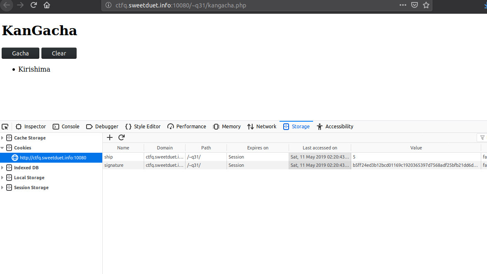
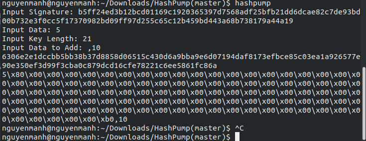
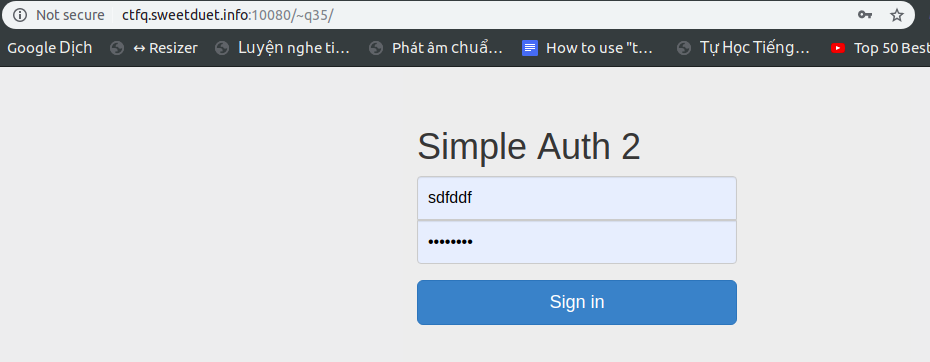
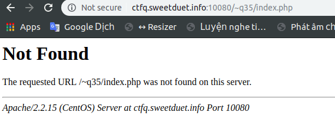
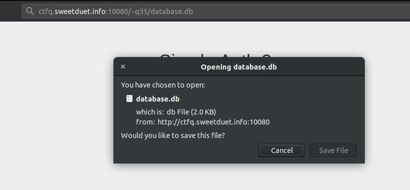
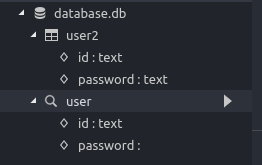
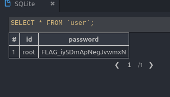

# Bài 2: Simple Auth
Problem: `http://ksnctf.sweetduet.info/problem/32`

Vào bài chúng ta sẽ thấy một đường dẫn `http://ctfq.sweetduet.info:10080/~q32/auth.php`
và một source code php

```php
<!DOCTYPE html>
<html>
  <head>
    <title>Simple Auth</title>
  </head>
  <body>
    <div>
<?php
$password = 'FLAG_????????????????';
if (isset($_POST['password']))
    if (strcasecmp($_POST['password'], $password) == 0)
        echo "Congratulations! The flag is $password";
    else
        echo "incorrect...";
?>
    </div>
    <form method="POST">
      <input type="password" name="password">
      <input type="submit">
    </form>
  </body>
</html>
```

Trước tiên là mình cứ và link kia và thấy nó hiển thị một form submit, thì mình cũng điền một cái gì đó vớ vẩn và submit xem sao thì tất nhiên là nhận được dòng chữ ` incorrect... ` rồi.

Đến đây mới bắt đầu nhìn vào source code mà bài cho. ok, nhìn đi nhìn lại thì source có vẻ viết khá là ok, php thì viết như thế này thôi.
Đọc logic nó chạy một tý, có vẻ như muốn có được flag thì password nhập vào phải khớp với password trên server. Chính là điểm cần khai thác rồi, cũng không chắc chắn lắm nhưng mình nghĩ là chính cái hàm so sánh ở câu lệnh  `strcasecmp($_POST['password'], $password) == 0` chính là điểm cần để ý ở đây.
Bắt đầu lên google search hàm  `strcasecmp` hoạt động như thế nào. à, thì ra `nó  sẽ so sánh hai chuỗi mà không phân biệt chữ hoa chữ thường, hàm trả về hiệu số giữa chiều dài chuỗi thứ nhất trừ đi chiều dài chuỗi thứ 2`. ok, hàm cũng bình thường mà. Đang tính bỏ cuộc thì search tìm thêm lần nữa để hiểu sâu hơn cách nó hoạt động thì bỗng nhận được 1 đoạn trích trong 1 bài viết về việc hàm này sẽ bị lỗi so sánh một string với một array.
Vậy thì dễ rồi, trong source dùng `$POST['password']` so sách với `$password - là flag chúng ta cần tìm` nếu đúng thì in ra flag.
`$password` chắc chắn là string rồi, vậy thì chỉ cần biến $POST['password'] thành mảng nữa là ok. Vậy thì vào lại trang submit, bấm f12 để show inspect code lên, sửa ô input từ `name='password'` thành  `name='password[]'` là được (kinh nghiệm code web cũng một năm mà :3).
Sửa xong rồi, điền đại một cái gì đó và submit thử. Và kết quả không mấy bất ngờ đó là `Congratulations! The flag is FLAG_VQcTWEK7zZYzvLhX `

=> Flag chính là `FLAG_VQcTWEK7zZYzvLhX`.

# Bài 3: KanGacha

Problem: `http://ksnctf.sweetduet.info/problem/31`

Vào bài chúng ta sẽ được cấp 1 trang `http://ctfq.sweetduet.info:10080/~q31/kangacha.php`,
và source code php như vầy:
```php
<?php

$salt = 'FLAG_????????????????';

$shipname = array(
    'Nagato',
    'Mutsu',
    'Kongo',
    'Hiei',
    'Haruna',
    'Kirishima',
    'Fuso',
    'Yamashiro',
    'Ise',
    'Hyuga',
    "Yamato [Congratulations! The flag is $salt. ??????????????????????????????????????.]"
);

//  Check signature and read
if (isset($_COOKIE['ship']) and
    isset($_COOKIE['signature']) and
    hash('sha512', $salt.$_COOKIE['ship']) === $_COOKIE['signature'])
    $ship = explode(',', $_COOKIE['ship']);
else
    $ship = array();

if (isset($_POST['submit']))
{
    //  Gacha
    if ($_POST['submit'] === 'Gacha')
    {
        //  Yamato is ultra rare
        $ship[] = mt_rand(0, count($shipname)-2);

        $s = implode(',', $ship);
        $sign = hash('sha512', $salt.$s);

        setcookie('ship', $s);
        setcookie('signature', $sign);
    }

    //  Clear
    if ($_POST['submit'] === 'Clear')
    {
        setcookie('ship', '', 0);
        setcookie('signature', '', 0);
    }

    header("Location: {$_SERVER['REQUEST_URI']}");
    exit();
}

?>
<!DOCTYPE html>
<html>
  <head>
    <title>KanGacha</title>
  </head>
  <body>
    <h1>KanGacha</h1>
    <form method="POST">
      <input type="submit" name="submit" value="Gacha">
      <input type="submit" name="submit" value="Clear">
    </form>
    <ul>
<?php
for ($i=0; $i<count($ship); $i++)
    echo "<li>{$shipname[$ship[$i]]}</li>\n";
?>
    </ol>
  </body>
</html>

```

Rồi xong, lại là một bài liên quan đến các hàm mật mã, thực sự thì mấy hàm về mã hóa và băm hơi kém nên cảm giác đã khó rồi. Nhưng thôi thì chày cối search các thứ xem như nào.
Trước tiên đọc code thì hiểu sơ qua là khi bấm nút submit thì client sẽ gưi cookies gồm 2 key là `ship`, `signature` thì hiểu `ship` chắc chắn là dữ liệu rồi, và `signature`. Rồi sau khi lên thì code php xử lý hash dữ liệu gửi lên và `signature` để xác định đó là dữ liệu đúng, sau đó thì random 1 số từ 0-9 để lấy bất kỳ ký phần tử nào trong mảng `$shipname` có đến 11 phần tử và phần tử 11 là chứa flag. Vậy là sẽ không bao giờ hàm random đó sẽ lấy được flag ra cho mình. Thuật toán băm ở đây là `sha512`.

OK, xác định được như vậy rồi nên google search xem có kiểu tấn công nào phù hợp không :D 
Thực ra thì google cứ search đúng trọng tâm từ khóa là kiểu gì cũng có, thử search với từ khóa `attack sha512 with cookie signature` thì nhận được `44.200 ` và phần lớn nhắc đến `Hash length Extension Attacks`. Thôi xong rồi, xác định là kiểu tấn công `Extension Attacks` thôi cho nó dễ tìm kiếm. Vậy là bắt tay tìm hiểu `Extension Attacks`.
Thì tìm hiểu một lúc cũng hiểu sơ sơ `Extension Attacks` là gì? 
**Trích đoạn:**
`Khi truy cập trang Web, kẻ tấn công được set cookie là data và signature. Hắn không biết salt được lưu trên server nhưng nếu hắn biết được độ dài của nó. Có nghĩa là hắn hoàn toàn biết được độ dài của satl||data được dùng để tính hash. Với độ dài trên và signature chính là hash của nó, hắn ta có thể chèn thêm dữ liệu giả mạo vào cookie và tính signature mới. Ví dụ, hắn chèn cookie data = data||padding||fake và tính signature mới cho dữ liệu giả mạo này. Khi server kiểm tra, signature hoàn toàn trùng khớp với dữ liệu giả. Vậy là kẻ tấn công đã thành công`.
Thì có vẻ đúng với bài của mình rồi. Giờ chỉ việc tìm tool để tạo được dữ liệu giả mạo thôi.
Thì quay lại trang tìm kiếm lúc nãy, thì lướt xuống phía dưới thấy có link github về `hashpump`. Cài đặt nó về dùng.


Ở đây có một số lưu ý: 

* Input data: Chính là data mình đã test trước đó trên trang web. Dữ liệu đúng.
* Input Key Length: Là độ dài dữ liệu sẽ được thêm vào hàm băm, ở bài này của mình chính là giá trị `$salt`. Mình không biết được dữ liệu thực nhưng biết được độ dài, nhờ vào source code.
* Input data to add: Là dữ liệu bạn muốn thêm vào để được một dữ liệu mới hợp lệ. Trong bài này, vì muốn sau khi chạy sẽ in ra phần tử thứ 10 trong mảng nên mình sẽ thêm là ,10.
=> Sau khi chạy thì sẽ được 1 giá trị data mới và giá trị `signature`.

Bây giờ chỉ cần gửi request lại trang web với phương thức get và kèm theo cookies là 2 giá trị mới tạo là được. Ở đây vì trình duyệt chromium mình dùng không cho sửa cookie nên viết một đoạn code python để request cho lẹ. (Lập trình muôn năm :3)

```py
import requests

url = "http://ctfq.sweetduet.info:10080/~q31/kangacha.php"

cookies = {
    'ship': '5%80%00%00%00%00%00%00%00%00%00%00%00%00%00%00%00%00%00%00%00%00%00%00%00%00%00%00%00%00%00%00%00%00%00%00%00%00%00%00%00%00%00%00%00%00%00%00%00%00%00%00%00%00%00%00%00%00%00%00%00%00%00%00%00%00%00%00%00%00%00%00%00%00%00%00%00%00%00%00%00%00%00%00%00%00%00%00%00%00%00%00%00%00%00%00%00%00%00%00%00%00%00%00%00%00%b0,10',
    'signature': '6306e2e1dccbb5bb38b37d8858d06515c430d6a9bba9e6d07194daf8173efbce85c03ea1a926577e90e350ef3d99f3cba0c879dcd16cfe78221c6ee5861fc86a'
}


res = requests.get(url, cookies=cookies)

print(res.text)
```

Sau khi chạy sẽ được kết quả:

```html
<!DOCTYPE html>
<html>
  <head>
    <title>KanGacha</title>
  </head>
  <body>
    <h1>KanGacha</h1>
    <form method="POST">
      <input type="submit" name="submit" value="Gacha">
      <input type="submit" name="submit" value="Clear">
    </form>
    <ul>
<li></li>
<li>Yamato [Congratulations! The flag is FLAG_uc8qVFa8Sr6DwYVP. This is called Length extension attack.]</li>
    </ol>
  </body>
</html>
```

=> Như vậy chúng ta đã lấy được flag là: `FLAG_uc8qVFa8Sr6DwYVP`

# Bài 4: Simple Auth II 

Problem: `http://ksnctf.sweetduet.info/problem/35`

Vào bài này chúng ta lại nhận được 1 trang login `http://ctfq.sweetduet.info:10080/~q35/auth.php`
và source code php

```php
<?php

function h($s)
{
    return htmlspecialchars($s, ENT_QUOTES, 'UTF-8');
}

if (!isset($_POST['id']) or !is_string($_POST['id']))
    $_POST['id'] = '';
if (!isset($_POST['password']) or !is_string($_POST['password']))
    $_POST['password'] = '';

$try = false;
$ok = false;

if ($_POST['id']!=='' or $_POST['password']!=='')
{
    $try = true;
    $db = new PDO('sqlite:database.db');
    $s = $db->prepare('SELECT * FROM user WHERE id=? AND password=?');
    $s->execute(array($_POST['id'], $_POST['password']));
    $ok = $s->fetch() !== false;
}

?>
<!DOCTYPE html>
<html>
  <head>
    <title>Simple Auth 2</title>
    <link rel="stylesheet" href="bootstrap.min.css">
    <style>
      body
      {
        padding: 40px;
        background: #eee;
      }
      .form-control
      {
        position: relative;
        font-size: 16px;
        height: auto;
        padding: 10px;
        box-sizing: border-box;
      }
      .form-control:focus
      {
        z-index: 2;
      }
      input[type="text"]
      {
        border-bottom-left-radius: 0;
        border-bottom-right-radius: 0;
      }
      input[type="password"]
      {
        border-top-left-radius: 0;
        border-top-right-radius: 0;
      }
      button
      {
        margin-top: 16px;
      }
    </style>
  </head>
  <body>
    <div class="container">
      <form method="POST" style="width:320px; margin:auto">
        <h1>Simple Auth 2</h1>

<?php if($try and $ok) { ?>
        <div class="alert alert-success">
          Congraturation!<br>
          The flag is <?php echo h($_POST['password']); ?>
        </div>
<?php } ?>

<?php if ($try and !$ok) { ?>
        <div class="alert alert-danger">
          Incorrect ID or password
        </div>
<?php } ?>

<?php if (!$ok) { ?>
        <input
          type="text"
          class="form-control"
          id="id"
          name="id"
          placeholder="ID"
          value="<?php echo h($_POST['id']); ?>">
        <input
          type="password"
          class="form-control"
          id="password"
          name="password"
          placeholder="Password">
        <button
          class="btn btn-lg btn-primary btn-block"
          type="submit">
          Sign in
        </button>
<?php } ?>
      </form>
    </div>
  </body>
</html>
```

Sau khi thử check các thứ trong trang login, và đọc qua source, thì khẳng định luôn là bài này sẽ không dính sql injection :( thế nên bỏ qua cách tấn công sql injection.
Bắt đầu đi search xem mấy hàm có sử dụng trong source như `is_string` để xem nó có dính lỗi gì vớ vẩn không? nhưng rất tiếc là không.
Đến đây thì bí ý tưởng rồi. Loay hoay một lúc chợt nhận ra trang này dùng  `apache` và `centos`. Rồi lại hack thời gian trở về những ngày tháng bị hành `php với apache` ở công ty cũ xem nó có tý nào có thể xem xét không.
Và thấy là `centos` thì chỉ hay bị mấy cái về phân quyền file cho project. Hồi xưa mơi cài apache vì chưa biết cách phân quyền cho hợp lý nên cứ `sudo chmod 777` nguyên cho cả project. Nghĩ đến đây thì cũng ngờ ngờ thôi, không biết đúng sai thế nào, nhưng phải thử.
Vào trở lại trang đăng nhập, xóa đoạn url là `auth.php`, mục đích là nếu dính vào mấy cái nói trên thì sẽ bị show ra tất cả file trong folder chứa project đó, biết đâu tìm được flag.
Nhưng đời không như mơ, :'( xóa xong để url không có `auth.php` nhưng vẫn bị chuyển hướng tới trang đăng nhập.

Ok, với php thì nếu vào project mà vẫn tự động vào file thì trong folder phải có file `index.php` hoặc `home.php` (cái này là mặc định).
Rồi thử điền url thêm `index.php` và `home.php` nhưng đều nhận kết quả là không tìm thấy file

Hoang mang lần 2. Thôi thì đọc lại code một lần nữa xem trong code có gì đặc biệt không.
Ồi không, nó dùng sqlite, và đường dẫn kết nối chỉ là `sqlite:database.db`, tức là file `database.db` sẽ nằm cùng thư mục với `auth.php`. Thế thì ngại gì mà không thử điền url thêm `database.db` vào.

Ơ kìa, ở gì kìa, nó cho tải file `database.db`. ối, thế thì mở lên để xem có gì nào.
Mở database ra thì nhận được 2 bảng `user2` và `user`

Mở bảng `user` lên thì thấy flag ở cột password.


=> Vậy flag sẽ là: `FLAG_iySDmApNegJvwmxN`